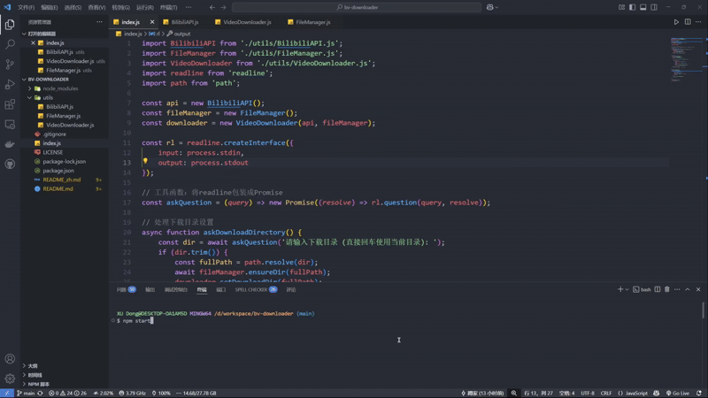

# BV 下载器

[English](README.md) | [简体中文](README_zh.md)

一个用于下载B站视频的命令行工具，支持BV号或视频URL下载。

## 使用演示



## 功能特性

- 支持通过B站视频URL或BV号下载视频
- 支持下载单个视频或整个视频合集
- 支持下载收藏夹内容（自建和订阅的收藏夹）
- 支持自定义下载目录
- 支持分P视频的批量下载
- 视频元数据获取与显示
- 下载进度条实时显示
- 自动创建视频合集目录
- 智能文件命名处理
- 自动跳过已下载文件
- 长视频时长检查功能

## 环境要求

- Node.js v16 或更高版本
- npm 或 yarn 包管理器

## 安装方法

```bash
# 克隆仓库
git clone https://github.com/yourusername/bv-downloader.git

# 进入项目目录
cd bv-downloader

# 安装依赖
npm install
```

## 使用说明

1. 启动程序：
```bash
npm start
```

2. 输入视频URL：
- 支持完整的B站视频URL
- 支持收藏夹URL
- 示例：
  - 视频：https://www.bilibili.com/video/BV1xx411c7mD
  - 自建收藏夹：https://space.bilibili.com/用户ID/favlist?fid=收藏夹ID&ftype=create
  - 订阅收藏夹：https://space.bilibili.com/用户ID/favlist?fid=收藏夹ID&ftype=collect

3. 配置全局设置：
- 选择是否跳过长视频时长检查
- 设置自定义下载目录

4. 选择下载模式（仅针对单个视频URL）：
- 选项1: 仅下载单个视频
- 选项2: 下载整个合集（如果存在）

## 注意事项

- 确保有足够的磁盘空间
- 下载过程中请保持网络连接
- 视频将按原始画质下载
- 合集下载会自动创建对应文件夹

## 免责声明

本工具仅供个人学习研究使用。作者不对使用本工具产生的任何后果承担责任。使用者应：

- 遵守相关法律法规使用本工具
- 尊重版权及知识产权
- 自行承担使用本工具产生的所有风险和责任
- 不得将本工具用于任何商业用途
- 不得使用本工具下载未经授权的内容

## 许可证

本项目基于 MIT 许可证开源 - 详见 LICENSE 文件。

## 致谢

- 感谢 Bilibili API 支持
- 感谢所有项目贡献者
